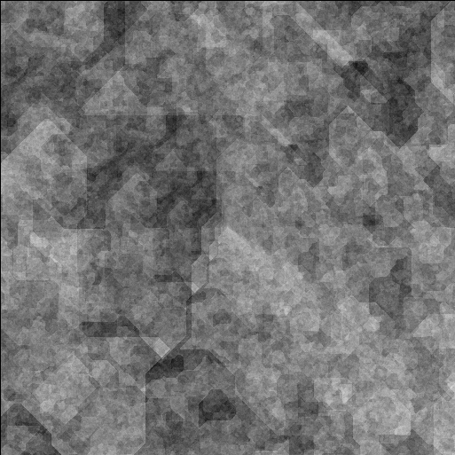

# Zahir-RL
This is a small sample of Rust code taken from a traditional roguelike I've been working on for the past couple of years or so (on-and-off; mostly off).
The code itself is primarily taken from the noise-gen portion of the codebase, with part of the `random` module included too.

